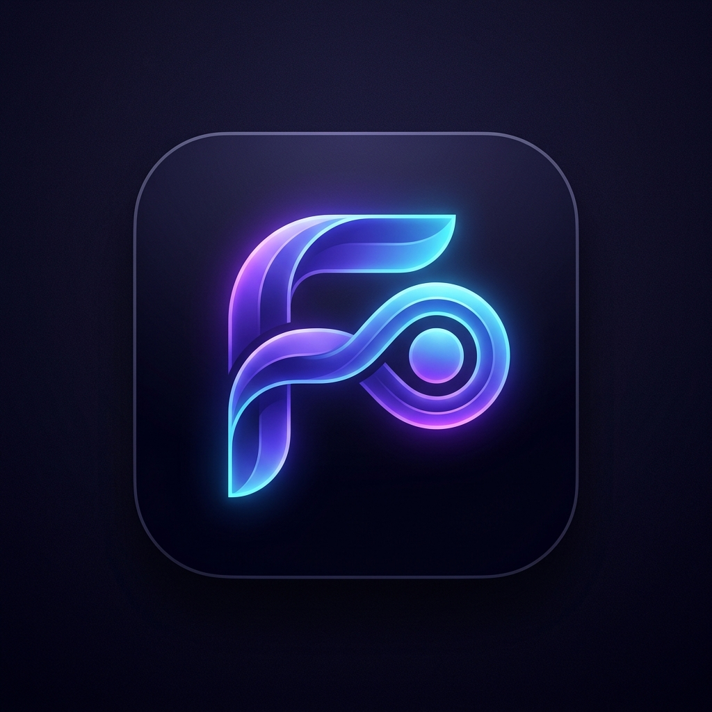

<div align="center">

  

  # FlowOS — Adaptive Day & Goal Operating System

  **An AI-powered operating system that organizes focus blocks, builds unbreakable habits, and recalibrates when reality changes.**

  [](#)
  [](#)
  [](#)
  [](#)
  [](LICENSE)

  <br />

  <p align="center">
    <a href="#-the-core-problem-reality-divergence">The Problem</a> •
    <a href="#-the-5-layer-ux-architecture">5-Layer Architecture</a> •
    <a href="#-key-features">Key Features</a> •
    <a href="#-tech-stack--architecture">Tech Stack</a> •
    <a href="#-getting-started">Getting Started</a> •
    <a href="#-project-structure">Project Structure</a>
  </p>

</div>

---

## 💡 The Core Problem: The "Reality Divergence Gap"

Traditional planners and habit trackers fail because they treat daily schedules as static checklists:
1. You plan an ideal 6-hour productive day.
2. Reality happens: a deep coding sprint overruns by 45 minutes, an unexpected meeting appears, or fatigue sets in.
3. Static apps leave you with an impossible, overflowing to-do list and guilt.

**FlowOS is designed around a single continuous adaptive loop:**

```
  GOAL ➔ PLAN ➔ EXECUTE ➔ OBSERVE REALITY ➔ DETECT DEVIATION ➔ REASON ➔ ADAPT ➔ LEARN
```

Complexity lives inside FlowOS. The user experiences calm, actionable clarity.

---

## 🧭 The 5-Layer UX Architecture

FlowOS structures your day through progressive disclosure across 5 intuitive layers:

```
┌────────────────────────────────────────────────────────────────────────┐
│  1. NOW (Command Center)       — "What should I be doing right now?"   │
│  2. PLAN (Goal & Schedule Hub) — Goals ➔ Milestones ➔ Tasks ➔ Timeline │
│  3. ADAPT (Reality Engine)     — Reality Triggers ➔ Impact ➔ What-If   │
│  4. UNDERSTAND (Self-Knowledge)— Analytics ➔ Heatmap ➔ Day Replay      │
│  5. WELLNESS (Circadian Rest)  — Hydration ➔ Nutrition ➔ Screen 20-20  │
└────────────────────────────────────────────────────────────────────────┘
```

### 1. ⚡ NOW (Command Center)
- **Active Focus Mission & Timer**: Planned vs. actual execution tracking with 1-click `+10m` extension and completion actions.
- **Single Primary Metric — Day Balance**: A unified $0\text{–}100\%$ score measuring schedule completion, habit consistency, and circadian recovery without dashboard clutter.
- **Next Best Action**: Highlights the single most impactful task to tackle next.
- **What Changed (Reality Alert)**: Surfaced dynamically when a task overruns or schedule drifts, offering concrete 1-click adaptation options (`[Apply]`, `[Simulate in What-If]`, `[Ignore]`).
- **Ask FlowOS**: Context-aware schedule arithmetic engine (e.g., *"Can I code for 2 extra hours without missing my 10:30 PM bedtime?"*).
- **Daily Readiness**: Self-reported planning signal (non-medical) that calibrates focus block sizes to daily sleep and physical stamina.

### 2. 🎯 PLAN (Goal & Schedule Hub)
- **Goal Decomposition**: Synthesizes broad goals into structured milestone roadmaps and daily execution tasks.
- **Obstacle Deconstructor**: Breaks psychological blockers and code friction into an immediate 10-minute micro-action.
- **Bifurcated Tasks & Habits**:
  - *One-Off Priority Tasks*: Subtasks, priority tags, and estimated vs. actual duration tracking.
  - *Recurring Habit Loops*: 7-day consistency heatmaps and streak-protecting **Grace Recovery Shields**.
- **24-Hour Day-Forge Schedule**: Circadian timeline balancing deep work, meals, movement, eye relief, and restorative sleep.

### 3. 🔄 ADAPT (Reality & Adaptation System)
- **1-Click Reality Triggers**: Instant recalibration triggers (*I woke up late*, *Task took longer*, *Unexpected meeting*, *Lost focus*, *Need a break*, *New urgent task*, *Completed early*, *Energy shift*, *Finish project today*).
- **Schedule Impact Inspector**: Automatically evaluates available buffer margins before bedtime or recovery windows are compromised.
- **What-If Scenario Sandbox**: Test complex schedule modifications side-by-side against your live schedule before committing.

### 4. 📊 UNDERSTAND (Analytics, Heatmap & Flow Profile)
- **4 Key Diagnostics**:
  1. *Time Leakage Analysis*: Identifies categories with systematic under-estimation.
  2. *Habit Consistency*: Diagnoses anchor habits and momentum stability.
  3. *Goal Velocity*: Tracks milestone advancement and execution bottlenecks.
  4. *Planning Realism Score*: Empirically evaluates schedule optimism vs. actual capacity.
- **365-Day Activity Heatmap**: Interactive GitHub-style activity matrix; clicking any day cell loads its chronological Day Replay.
- **Day Replay Timeline**: Experiential timeline player with scrubber controls and variable playback speed ($1\text{x}, 2\text{x}, 4\text{x}$).
- **Personal Flow Profile**: Behavioral dimensions with transparent provenance badges (`OBSERVED`, `INFERRED`, `USER-PROVIDED`).
- **Evening Reflection Ritual**: Guided daily debrief to log wins, analyze friction, and lock in tomorrow's #1 anchor task.

### 5. 🧘 WELLNESS (Biological Rhythm & Comfort)
- **Hydration Fuel Station**: 8-glass water tracker with quick-log buttons.
- **Nutrition & Fuel Planner**: Clean-energy, high-protein, and plant-powered meal presets synchronized with focus slots.
- **Screen Guardian**: $20\text{-}20\text{-}20$ eye strain countdown timer, posture alignment checks, and digital sunset reminders.

---

## 🛠️ Modular Workspaces & Specialized Tools

| Workspace | Purpose | Key Features |
| :--- | :--- | :--- |
| **Focus Room** | Deep work immersion | Fullscreen Zen mode, live Web Audio visualizer, floating Picture-in-Picture (PiP) timer, Alpha (10Hz) & Gamma (40Hz) soundscapes |
| **Motivation & Quests** | Gamified engagement | Weekly Boss Battle (*The Procrastination Golem*), daily combat quests, XP leveling, streak badges |
| **Care & Accessibility** | Senior & accessible use | High-contrast large-font view, routine medication reminders, scheduled appointments |
| **Device Sync & Data** | Zero-server data portability | 1-click mobile QR code sync, complete JSON state backup/restore, standard iCalendar (.ics) exports |
| **Showcase & Archetypes** | 1-Click user calibration | Pre-configured blueprints for Students, Software Engineers, Founders, and Wellness Trackers |

---

## 💻 Tech Stack & Architecture

FlowOS is engineered with a **zero-dependency, modular Vanilla architecture**:

- **Core Logic**: Modular ES6+ JavaScript classes (29 decoupled engines).
- **Styling**: Pure Vanilla CSS with Design Tokens, Neo-Glassmorphism, and responsive CSS Grid/Flexbox layouts.
- **Audio Engine**: Pure Web Audio API procedural sound synthesizer (synthesizes binaural alpha beats, gamma waves, rain, and ocean surf in real-time with **zero audio file downloads**).
- **State Store**: Centralized reactive state store (`StateManager`) with automatic `localStorage` persistence and legacy migration support.
- **Offline & PWA**: Service Worker caching (`sw.js`) and installable Web App Manifest (`manifest.json`).
- **Portability**: RFC 5545 compliant iCalendar (`.ics`) generator and lossless JSON backup/restore.

---

## 🚀 Getting Started

### 1. Clone the Repository
```bash
git clone https://github.com/Prathamesh-Labs/FlowOS.git
cd FlowOS
```

### 2. Run Locally
FlowOS runs entirely in the browser without build steps or npm installations:

**Using Python:**
```bash
python -m http.server 8080
```

**Using Node / npx:**
```bash
npx serve .
```

Open [http://localhost:8080](http://localhost:8080) in any modern browser.

### 3. Interactive Demo vs. Clean State
FlowOS includes an **Interactive Demo Mode** toggle in the top header:
- **Demo Mode**: Pre-loaded with a realistic day plan, active focus timer, sample reality events, and historical analytics.
- **Clean State**: Resets to an empty first-user state ready for your own goals, tasks, and routines.

---

## 📁 Project Structure

```
FlowOS/
├── assets/                  # Icons, favicon, and brand logos
│   ├── favicon.png
│   └── flowos-logo.png
├── css/                     # Design tokens and modular stylesheets
│   ├── accessibility.css    # High-contrast & care mode overrides
│   ├── components.css       # Cards, timers, badges, and modals
│   ├── design-tokens.css    # Color palette, spacing, and typography tokens
│   └── layout.css           # 5-layer shell, sidebar, and subnav switchers
├── js/                      # 29 Modular JavaScript Engines
│   ├── ai-engine.js         # Schedule generator & overrun rebalancer
│   ├── analytics-engine.js  # 4 self-understanding diagnostics
│   ├── app.js               # Master UI coordinator & reactive router
│   ├── ask-flowos.js        # Schedule arithmetic decision assistant
│   ├── audio-synth.js       # Procedural Web Audio API soundscape generator
│   ├── calendar-export.js   # iCalendar (.ics) and JSON backup/restore
│   ├── copilot-engine.js    # Contextual Copilot assistant
│   ├── custom-media.js      # Custom audio player & focus embeds
│   ├── diet-planner.js      # Nutrition presets & brain-fuel guides
│   ├── digital-twin.js      # Personal Flow Profile engine
│   ├── elderly-mode.js      # Care mode, medication & appointment logs
│   ├── experience-engine.js # Morning briefing, reflection, & XP leveling
│   ├── focus-engine.js      # Countdown/stopwatch timer & overrun handler
│   ├── goal-intelligence.js # Goal synthesizer & obstacle deconstructor
│   ├── heatmap-engine.js    # 365-day activity matrix with Day Replay jump
│   ├── memory-replay.js     # Experiential Day Replay player
│   ├── notification-engine.js # Desktop notifications & interval checks
│   ├── onboarding-engine.js # Archetype selector & PWA installer
│   ├── personal-learning.js # Empirical estimation variance tracker
│   ├── pip-timer.js         # Document Picture-in-Picture floating timer
│   ├── qr-sync.js           # Zero-server offline QR pairing engine
│   ├── quests-engine.js     # RPG boss battle & daily combat quests
│   ├── readiness-engine.js  # Self-reported daily readiness index
│   ├── reality-events.js    # Reality divergence triggers & impact calculator
│   ├── scenario-simulator.js# What-If sandbox schedule simulator
│   ├── screen-guardian.js   # 20-20-20 eye strain & posture guardian
│   ├── state.js             # Central reactive state manager (v4)
│   ├── tasks-habits.js      # Tasks & habits bifurcated manager
│   └── voice-engine.js      # Voice command intent parser & text fallback
├── index.html               # Main application shell
├── manifest.json            # PWA manifest
├── sw.js                    # Service Worker for offline functionality
├── LAUNCH_STORY.md          # Launch narrative & social copy
└── README.md                # Project documentation
```

---

## 🔒 Privacy & Data Ownership

- **100% Client-Side**: All data, goals, schedules, and reflection notes are stored exclusively in your browser's `localStorage`.
- **Zero Telemetry**: No third-party trackers, analytics scripts, or cloud databases.
- **Full Portability**: Export your data anytime via standard `.ics` calendar files or full JSON backups.

---

## 📄 License

This project is licensed under the **MIT License** — see the [LICENSE](LICENSE) file for details.
